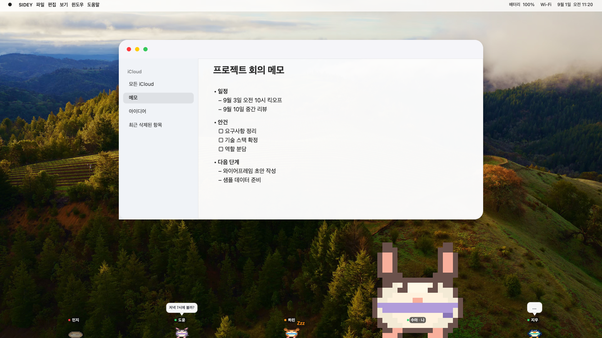

```text
███████╗██╗██████╗ ███████╗██╗   ██╗        /\_/\
██╔════╝██║██╔══██╗██╔════╝╚██╗ ██╔╝       ( •.• )
███████╗██║██║  ██║█████╗   ╚████╔╝         > ^ <
╚════██║██║██║  ██║██╔══╝    ╚██╔╝                    ʕ•ᴥ•ʔ
███████║██║██████╔╝███████╗   ██║                     /| |\
╚══════╝╚═╝╚═════╝ ╚══════╝   ╚═╝                      / \          ●  your friends, beside you.
```

# SIDEY

화면 가장자리의 2D 픽셀 동물로 친구들과 대화하는 데스크톱 오버레이 메신저입니다.

공식 웹사이트: [sidey-app.github.io/SIDEY](https://sidey-app.github.io/SIDEY/)



## 설치

### macOS

macOS 26 이상 Apple Silicon Mac을 지원합니다. Intel Mac은 지원하지 않습니다.

Homebrew로 설치하려면 다음 명령을 실행합니다.

```sh
brew install --cask sidey-app/tap/sidey
```

직접 설치하려면 [SIDEY Releases](https://github.com/sidey-app/SIDEY/releases)에서 최신 `SIDEY-macOS-arm64-<version>.dmg`를 받은 뒤 `SIDEY.app`을 Applications 폴더로 옮깁니다. 새로 설치할 때는 ZIP이 아닌 DMG를 사용하세요.

현재 공개 버전은 `v1.0.6`(build 17)입니다.

### Windows

Windows 11 25H2 이상 x64 PC를 지원합니다.

[SIDEY Releases](https://github.com/sidey-app/SIDEY/releases)에서 최신 `SIDEY-Windows-x64-v<version>.msi`를 받아 실행합니다.

Windows v1.0.3 또는 v1.0.4는 앱 안에서 업데이트 파일을 내려받지 못하므로, v1.0.5 MSI를 한 번 직접 받아 설치해야 합니다. 설정과 로그인 정보는 유지됩니다.

Windows 버전은 현재 공인 코드 서명 전 정식판입니다. SmartScreen 경고가 표시되거나 일부 보안 설정에서 실행이 차단될 수 있습니다.

## 최신 업데이트

### macOS · 2026년 9월 4일 · v1.0.6

- 네트워크 연결이 끊겼다가 돌아온 뒤 앱을 재실행해야 정상화되던 문제를 수정했습니다.
- 재연결 과정에서 내 캐릭터가 회색, 친구들이 빨간색으로 반복 표시되던 현상을 수정하고 그룹·메시지·상태를 자동으로 다시 맞춥니다.

### Windows · 2026년 9월 3일 · v1.0.5

- 업데이트 설치 파일을 내려받을 때 파일 사용 중 오류로 중단되던 문제를 수정했습니다.
- v1.0.5를 직접 설치한 뒤부터는 다음 업데이트를 앱 안에서 받을 수 있습니다.

## 추후 개선 및 개발 예정

- 새로운 말풍선 디자인 추가
- **Windows:** 기능 안정화
- 캐릭터 드래그 앤 드롭 기능
- 캐릭터 효과음
- **macOS:** 이모지 입력이 되지 않는 문제 개선

위 항목은 개발 예정 내용이며 일정과 제공 순서는 변경될 수 있습니다.

## Contributors

SIDEY를 함께 만들어 주신 분들께 감사드립니다.

### Windows 개발

<table>
  <tr>
    <td align="center" width="120">
      <a href="https://github.com/patulus">
        <br>
        <sub><strong>@patulus</strong></sub>
      </a><br>
      <sub>Windows 개발</sub>
    </td>
  </tr>
</table>

### 캐릭터 에셋 기여

새로운 픽셀 캐릭터와 투척물 에셋 기여를 기다리고 있습니다.
[에셋 제작 규격과 제출 방법](assets/README.md)을 읽고 파일을 `assets/v1`에 추가한 뒤
[캐릭터 에셋 전용 PR 양식](.github/PULL_REQUEST_TEMPLATE/character_asset.md)으로 제출해 주세요.

유료 캐릭터는 PR을 열기 전에 판매·정산 조건을 협의해야 합니다.
[ryu200112@gmail.com](mailto:ryu200112@gmail.com)으로 문의해 주세요.

## 라이선스

유료 캐릭터와 전용 투척물은 공개 저장소에서 열람할 수 있지만 오픈소스 에셋은 아닙니다.
복제·수정·재배포·상업 이용 조건은
[SIDEY Paid Asset License 1.0](assets/PAID_ASSET_LICENSE.md)을 확인해 주세요.
