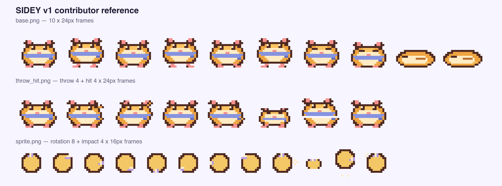

# SIDEY 픽셀 에셋 라이브러리

이 폴더는 SIDEY에서 사용하는 승인된 픽셀 에셋의 원본입니다. 공개 규격은
[`v1/manifest.json`](v1/manifest.json)과 캐릭터별 `base.png`, `throw_hit.png`,
말풍선별 `decoration.png`·`preview.png`, 투척물별 `sprite.png` 및 필요한
별도 emitter·preview입니다.

앱과 웹 폴더에 있는 같은 PNG 및 Windows BGRA 파일은 배포용 복사본입니다.
해당 파일은 직접 편집하지 않고 이 폴더의 원본에서 갱신합니다.

[공개 에셋 프리뷰어](https://sidey-app.github.io/SIDEY/contribute/asset-previewer/)는
파일을 서버로 보내거나 저장하지 않고 현재 브라우저의 메모리에서만 처리합니다.
SIDEY 웹 클라이언트가 아니라, 에셋을 제출하기 전에 실제 동작을 확인하는
컨트리뷰터용 도구입니다.

## 라이선스

`v1/manifest.json`의 `licensing`에 등록된 유료 캐릭터·말풍선·투척물은
[SIDEY Paid Asset License 1.0](PAID_ASSET_LICENSE.md)이 적용되는 독점 에셋입니다.
소스가 공개되어 있어 열람할 수 있지만 오픈소스 에셋은 아닙니다.

공식 SIDEY 앱이 계정의 사용 권한에 따라 표시하거나, SIDEY 개발·검토를 위해
로컬에서 확인하는 범위만 허용합니다. 다른 앱이나 상품에서 복제·수정·재배포·판매할
수 없으며, 앱·웹·Windows BGRA mirror에도 같은 조건이 적용됩니다.

이 라이선스는 manifest에 유료로 지정되지 않은 에셋이나 소프트웨어 코드에는
적용되지 않습니다. 해당 파일은 별도 라이선스가 명시되지 않았다면 기본 저작권
조건을 따릅니다.

## 프레임 계약

### 기본 캐릭터 `base.png`

- `240×24` px, `24×24` px 셀 10개
- 0–1: idle 기본/호흡
- 2–5: 네 단계 보행
- 6–7: 서서 졸기/고개 끄덕임
- 8–9: 웅크린 offline 수면/호흡

### 캐릭터 동작 `throw_hit.png`

- `192×24` px, `24×24` px 셀 8개
- 0–3: 준비 → 힘주기 → 놓기 → 팔로스루
- 4–7: 접촉 → 눌림 → 튕김 → 복귀

### 투척물 `sprite.png`

- `192×16` px, `16×16` px 셀 12개
- 0–7: 프레임 사이에서 중심이 움직이지 않는 회전
- 8–11: 접촉 → 눌림 → 튕김 → 복귀

### 말풍선

- `decoration.png`: `16×16` px RGBA 좌상단 장식
- `preview.png`: `128×48` px, 실제 글꼴·글자색을 포함한 전체 말풍선
- 핑크 토끼·버터 병아리의 글자는 `#1C1F29`, 별밤 고양이는 `#FFF7E8`

### 미니 대포

- `emitter.png`: `96×24` px, `24×24` px 셀 4개(등장·준비·발사·반동)
- `sprite.png`: `192×16` px, 심지탄 비행 8프레임과 폭발 4프레임
- emitter는 캐릭터 앞 몸통에 겹치고 폭발은 피격자 몸통 높이에 표시

## 공통 제작 규칙

- sRGB, 8-bit RGBA, hard alpha(`0` 또는 `255`), 투명 배경
- 캐릭터 모든 프레임의 가장 낮은 불투명 픽셀은 바닥에서 3px 위의 같은 발 기준선
- 투척물 0–7 프레임의 회전 중심은 `7.5, 7.5`에 고정
- 안티앨리어싱과 실시간 그림자 금지
- 화면 확대는 `2×`, `3×`, `4×` 같은 정수 nearest-neighbor만 사용
- 픽셀을 흐리게 만드는 비정수 크기, 선형 보간, 반투명 가장자리 금지

별빛 우파루파처럼 idle 상태에서 후광처럼 보이는 ambient sparkle과 더블클릭
particle burst 효과를 제안할 수 있습니다. 이러한 효과는 PNG 프레임이 아니라
별도의 렌더러 기능입니다. 성능·색상·밀도·지속 시간 검토와 macOS·Windows별
구현이 필요하며, 에셋 제출만으로 제품에서 자동 활성화되지는 않습니다.

## 신규 제출 절차

1. 종류에 맞는 `assets/v1/characters`, `bubbles`, `throwables` 하위 경로에 원본을 추가합니다.
2. `manifest.json`에 상대 경로, SHA-256과 `supported_platforms`를 등록합니다.
3. 캐릭터는 시그니처 투척물 매핑과 fallback도 갱신합니다.
4. 공용 브랜치에서는 `python3 scripts/validate_pixel_assets.py --canonical-only`, 플랫폼 mirror가 합쳐진 브랜치에서는 옵션 없이 전체 검사를 실행합니다.
5. PR 유형에서 `캐릭터 에셋`을 선택하고
   [캐릭터 에셋 전용 PR 양식](../.github/PULL_REQUEST_TEMPLATE/character_asset.md)에
   원본 전체본과 프리뷰어 검사 결과를 첨부합니다.
6. 중앙 변경을 먼저 리뷰한 뒤 플랫폼별 catalog와 배포 복사본은 별도 후속 PR에서
   갱신합니다.

검사 통과를 위해 규격을 억지로 재인코딩하지 말고 원본 제작 파일에서 문제를
바로잡아 주세요. 승인된 `v1` 파일을 변경해야 한다면 기존 hash를 조용히 덮지
말고 변경 이유와 호환 영향을 함께 리뷰해야 합니다.
