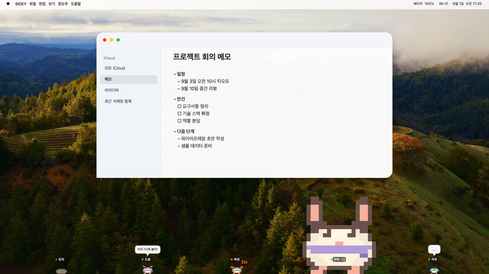

    <picture>
      
  </picture>

<h1 align="center">
  SIDEY
</h1>

  <b>朋友们，蹦蹦跳跳来到你的屏幕上。</b>

  <a href="https://sidey-app.github.io/SIDEY/">官方网站</a>
   · 
  <a href="#安装">安装</a>
   · 
  <a href="https://github.com/sidey-app/SIDEY/releases">发行说明</a>
   · 
  <a href="https://github.com/sidey-app/SIDEY/issues">错误报告</a>

  
🌐 Languages

   

[한국어](https://github.com/sidey-app/SIDEY?tab=readme-ov-file) &nbsp;&nbsp; [English](README.en.md) &nbsp;&nbsp; [日本語](README.ja.md) &nbsp;&nbsp; **简体中文**

[繁體中文](README.zh-Hant.md) &nbsp;&nbsp; [Русский](README.ru.md) &nbsp;&nbsp; [Українська](README.uk.md) &nbsp;&nbsp; [Français](README.fr.md)

[Deutsch](README.de.md) &nbsp;&nbsp; [Español](README.es.md) &nbsp;&nbsp; [Italiano](README.it.md) &nbsp;&nbsp; [Português (Portugal)](README.pt-PT.md)

[Português (Brasil)](README.pt-BR.md) &nbsp;&nbsp; [Čeština](README.cs.md) &nbsp;&nbsp; [Türkçe](README.tr.md) &nbsp;&nbsp; [Română](README.ro.md)

[Български](README.bg.md) &nbsp;&nbsp; [Српски (ћирилица)](README.sr-Cyrl.md) &nbsp;&nbsp; [Srpski (latinica)](README.sr-Latn.md) &nbsp;&nbsp; [Polski](README.pl.md)

[Nederlands (België)](README.nl-BE.md) &nbsp;&nbsp; [Nederlands](README.nl.md) &nbsp;&nbsp; [עברית](README.he.md)

## 简介

SIDEY 是一款适用于 macOS 和 Windows 的桌面聊天应用，让你通过屏幕边缘的 2D 像素小动物与朋友聊天。每个角色都代表一位真实的朋友，工作或休息时，你都能看到朋友的状态和简短消息。

- **手头的事照常做：** SIDEY 显示在屏幕上时，你仍然可以像平时一样点击和使用后面的应用。
- **瞧瞧朋友在不在：** 看看角色是在散步、打盹还是睡觉，就能知道朋友现在是否在线。
- **想到就聊一句：** 打开 SIDEY，发条简短消息，或和朋友互相逗趣。

## 安装

### macOS

**系统要求：** macOS 26 或更高版本 · Apple Silicon

  

### Windows

**系统要求：** Windows 10 1809 或更高版本 · x64 / ARM64

  

## 错误报告与功能建议

如果发现错误或希望提出功能建议，请按照 [GitHub Issues](https://github.com/sidey-app/SIDEY/issues) 提供的模板提交 Issue。

日志和截图中不得包含访问令牌、邀请码、消息内容或个人信息。

---

[服务条款](https://sidey-app.github.io/SIDEY/terms/) · [隐私政策](https://sidey-app.github.io/SIDEY/privacy/) · [撤销购买与退款政策](https://sidey-app.github.io/SIDEY/refund/)
